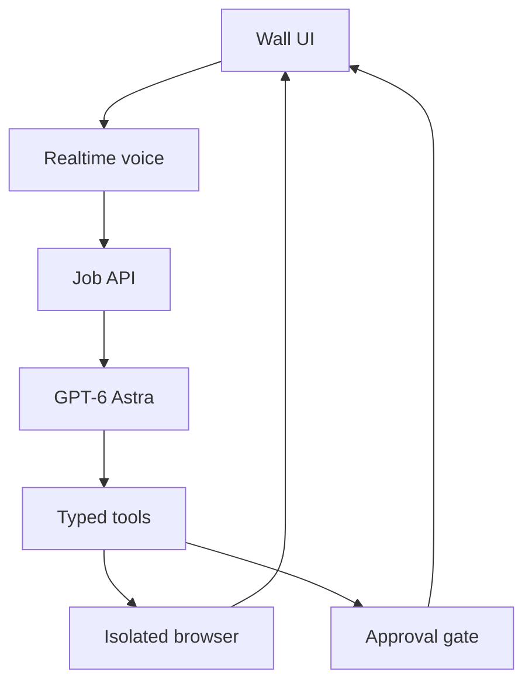

# Radian

A Mac-first spatial AI workspace inspired by OpenAI's GPT-6 Astra launch film. It combines a full-screen visual interface, low-latency Realtime voice, GPT-6 Astra task orchestration, a controlled Playwright browser, and explicit approval gates.

> **Think out loud.**

This is a functional prototype, not an OpenAI product or an attempt to reproduce unreleased launch-demo software.

## What works

- Full-screen wall interface with idle, listening, planning, working, approval, presenting, and error states
- Push-to-talk speech-to-speech session using `gpt-realtime-2.1` over WebRTC
- Optional “Hello Radian” wake word using the browser speech-recognition service
- Voice handoff to `gpt-6-astra` through the Responses API
- Persistent isolated Chromium browser with public-network restrictions
- Live job updates over server-sent events
- Approval gate for external or sensitive actions
- Production-studio connectors for Google Workspace, Slack, Blender, and Bambu Lab printers
- Mobile approval controller and operator-defined webhook connectors
- Mock mode for testing the entire UI without API access
- macOS kiosk launcher

## Architecture



The Realtime model owns the conversation. Complex work is submitted to Astra. Astra can browse and present results, but all state-changing actions must stop at the approval gate.

## Requirements

- macOS 14 or newer
- Node.js 22 or newer
- Google Chrome or Microsoft Edge for kiosk mode
- OpenAI API project with access to `gpt-realtime-2.1` and `gpt-6-astra` for live mode

## Install

```bash
npm install
npx playwright install chromium
cp .env.example .env
```

Start in mock mode:

```bash
npm run dev
```

Open `http://localhost:5173`, or launch the wall view:

```bash
npm run kiosk
```

## Enable live Astra mode

Edit `.env`:

```dotenv
OPENAI_API_KEY=your_project_api_key
ASTRA_MODEL=gpt-6-astra
REALTIME_MODEL=gpt-realtime-2.1
REALTIME_VOICE=marin
MOCK_MODE=false
```

Restart `npm run dev`. The API key stays on the server and is never returned to the browser.

## Operating the prototype

1. Select **Speak** and allow microphone access.
2. Speak a request. The voice agent hands substantive work to Astra.
3. Watch task status and controlled-browser screenshots on the wall.
4. Approve or cancel any state-changing action.
5. Use the text field as a fallback during development.

To use hands-free activation, select the wave icon once and grant microphone permission. While armed, saying “Hello Radian” or using “Radian” in a phrase starts the full voice session. Browser speech-recognition availability varies, and recognition may be processed by the browser vendor; the status bar reports when wake listening is active.

## Security boundaries

The v0 browser blocks localhost, `.local` names, loopback, link-local, and common private IPv4 ranges. It has no password-manager access and no host shell tool. Browser pages are treated as untrusted content.

Before connecting real accounts:

- Run the browser worker in a separate VM or hardened container.
- Use dedicated, least-privilege service accounts.
- Add DNS resolution checks to prevent hostname-based SSRF and rebinding.
- Add an allowlist for production websites.
- Store audit events in a durable database.
- Require a PIN or second device for financial approvals.
- Add rate and spend limits.

Do not use the prototype for purchases, production changes, or destructive actions.

## Current limitations

- Browser login persistence is intentionally disabled.
- The browser tool uses visible text and labels, not arbitrary desktop control.
- Jobs and audit events are held in memory and reset when the server restarts.
- Mock mode does not open a browser or call OpenAI.
- Live API execution cannot be verified without an API key and model access.

## Useful next integrations

Build direct API tools before relying on visual browser control:

1. Google Drive read-only search
2. Google Analytics and advertising reports
3. Slack search and message drafting
4. Presentation and document creation
5. A phone-based approval controller

See [Integration and hardware guide](docs/IMPLEMENTATION-GUIDE.md) for the recommended architecture, implementation sequence, security controls, and screen/projector options.

Connector installation and account setup are documented in [Studio connectors](docs/STUDIO-CONNECTORS.md).

## References

- [GPT-6 Astra model](https://developers.openai.com/api/docs/models/gpt-6-astra)
- [Realtime API with WebRTC](https://developers.openai.com/api/docs/guides/realtime-webrtc)
- [Computer use](https://developers.openai.com/api/docs/guides/tools-computer-use)
